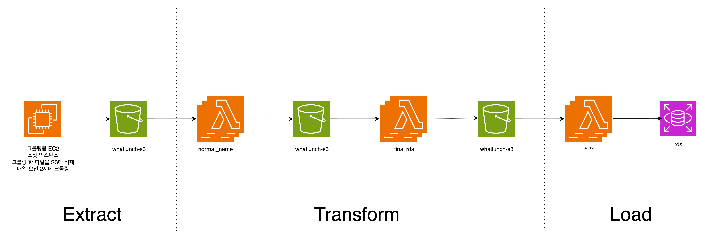

# Softeer6th - team4 점심뭐먹지 
## 프로젝트 주제: 매입경쟁이 심해지는 중고차 경매 매물의 상한가 결정

### 문제 상황
- 상황

  - 중고차 시장에 진입하는 신규 기업 증가와 경쟁매입의 일반화로 중고차 매입 경쟁이 심해지고, 낙찰시세 정보는 더 많이 공개되고 있는 상황.

  - 중고차 매입대수가 곧 중고차 시장의 시장점유율을 의미하고 매출의 크기로 이어짐.

  - 시장점유율 확보를 위한 경쟁이 치열한 상황.

- 누구: 중고차 판매 기업의 중고차 경매 매입부의 팀장

- 문제: 감으로 인한 매입가 산정으로 인해 시장 점유율이 떨어지고 있는 상황.

### 해결
- 중고차 낙찰시세 정보를 활용해 중고차 매물에 대한 매입가 산정 

### ETL 파이프라인

#### 파이프라인 설계 시 중요 고려요소
- 자동화: 수집부터 RDS 적재까지 자동화.
- 안정성(장애대응): 어디서 문제가 생겼는지 확인하고 조치 가능하게끔.
- 구현 용이성: 프로젝트에서 사용가능한 서비스와 보유 지식을 고려하여 구현이 용이한 서비스 활용.

#### Extract
1. 총 4개의 소스에서 데이터 수집
2. EC2내 크론탭으로 특정 시간에 수집되도록 스케줄링
3. 최대한 원본데이터를 변환하지 않고 저장.
#### Transform
1. 람다를 활용해서 데이터 변환
2. 소스별로 다양하게 적힌 모델명 통합.
3. rds 적재 전 컬럼별 데이터 포맷 통합
#### Load
1. RDB에 데이터를 적재

## 팀원 소개
<br/>

<div align="center">
<table>
<th>팀원</th>
    <th> 노선우 <a href="https://github.com/SsunyR"><br/><a></th>
	  <th> 김의진 <a href="https://github.com/uijinee"><br/></a></th>
    <th> 조원영 <a href="https://github.com/ThinkKat"><br/></a></th>
  </table>
</div>
<br />
<br />

## 프로젝트 기간
- 기간: 2025.08.04 ~ 2025.08.29

---
## Git Commit Message 규칙 (팀 공용)

### 1. 기본 구조

```
<type>(<scope>): <subject>

<body>
<footer>
```

* **type** : 커밋의 성격 (필수)
* **scope** : 변경된 영역/모듈 (선택)
* **subject** : 한 줄 요약, 마침표 X, 명령문 사용
* **body** : 상세 설명 (선택, 여러 줄 가능)
* **footer** : 관련 이슈 번호, 브레이킹 체인지 표시 (선택)

---

### 2. Type 종류

| type       | 설명                       |
| ---------- | ------------------------ |
| `feat`     | 새로운 기능 추가                |
| `fix`      | 버그 수정                    |
| `docs`     | 문서 변경 (README, 주석 등)     |
| `style`    | 코드 포맷팅/세미콜론 등, 로직 변경 없음  |
| `refactor` | 코드 리팩터링 (동작 변화 없음)       |
| `perf`     | 성능 개선                    |
| `test`     | 테스트 코드 추가/수정             |
| `chore`    | 빌드/패키지 설정, CI/CD 등 기타 변경 |
| `revert`   | 이전 커밋 되돌리기               |

---

### 3. 작성 규칙

* subject는 **50자 이내**, 명령형 어조로 작성

* `Add` 대신 `add` (소문자 시작 권장)
  
* 영어/한글 모두 가능 (type은 영어 유지)
  
* 한 커밋에는 **한 가지 변경사항만** 포함
  
* 이슈 트래킹 시 footer에 `Closes #이슈번호` 또는 `Refs #이슈번호`

---

### 4. 예시

```
feat(parser): 차량 상세 파싱 로직 추가

fix(scraper): ReadTimeout 발생 시 재시도 로직 보완

docs: README.md에 실행 방법 및 커밋 규칙 추가

refactor: fetch_list_urls 함수 구조 단순화

chore: requirements.txt에 ijson 추가

feat(crawler): 차량 경매 크롤링 CLI 옵션 추가

Closes #12
```
