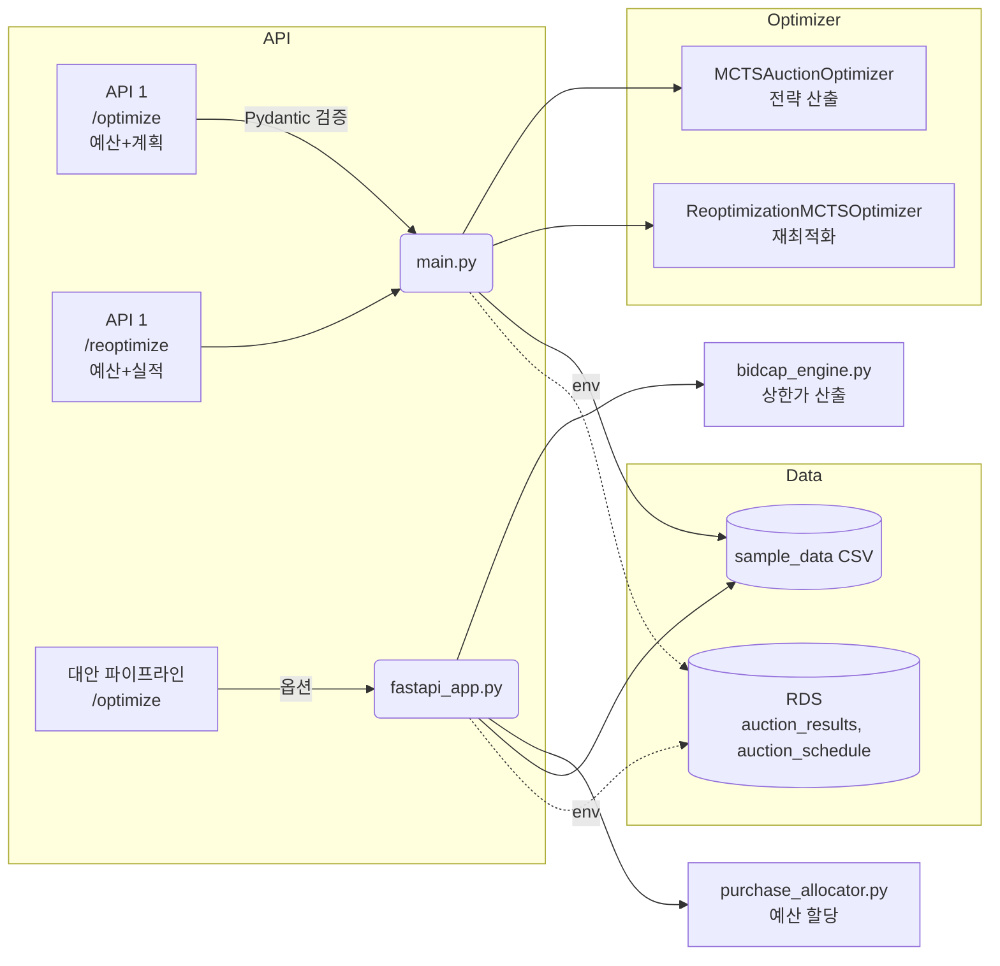
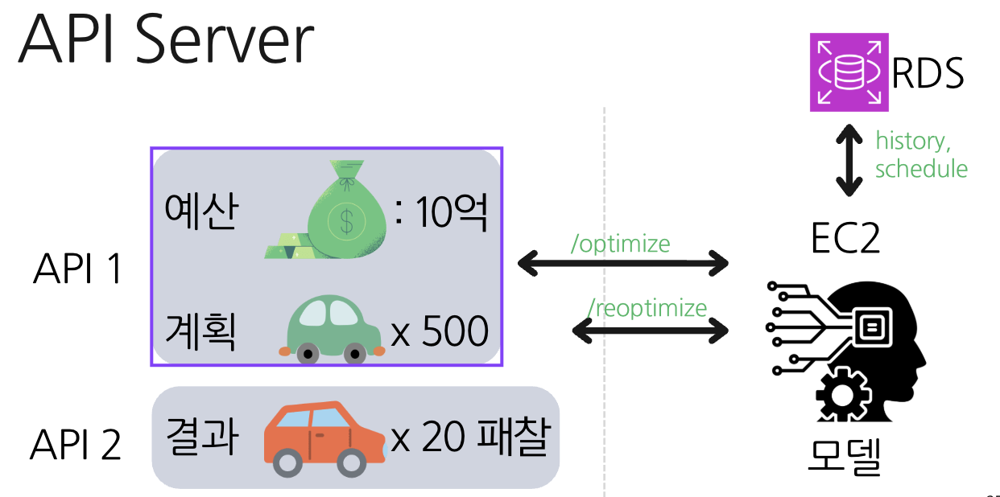

WhatLunch API Server

한눈에 보기
- 목적: 중고차 경매에서 예산과 목표를 만족하는 입찰 전략 산출
- 진입점: `main.py`(권장, MCTS 기반) / 보조: `fastapi_app.py`(상한가+할당)
- 문서: Swagger UI `http://localhost:8000/docs`

빠른 시작(TL;DR)
1) 가상환경 및 패키지 설치
```
python -m venv .venv && source .venv/bin/activate
pip install fastapi uvicorn pydantic pandas numpy sqlalchemy psycopg2-binary python-dotenv
```
2) 서버 실행
```
uvicorn main:app --reload --port 8000
```
3) 예제 요청(`/optimize`)
```
curl -X POST http://localhost:8000/optimize \
  -H "Content-Type: application/json" \
  -d '{
        "month": "2025-08",
        "budget": 50000000,
        "purchase_plans": [
          {"brand":"현대","model":"아반떼","year":2020,"target_units":3},
          {"brand":"기아","model":"K5","year":2019,"target_units":2}
        ]
      }'
```

아키텍처 개요


비주얼 개념도
- 아래 이미지를 `project/api/server/docs/api-server.png`로 저장하면 README가 자동으로 표시합니다.



대체(텍스트 기반) 다이어그램
```mermaid
flowchart LR
  user[예산: 10억\n계획: 차량 x500] -->|/optimize| svc[API Server]
  fb[결과 피드백\n(당일 성과)] -->|/reoptimize| svc
  svc -->|history,schedule| rds[(RDS)]
  svc --> model[모델/MCTS]
  model --> svc
  svc --> resp[전략, 예상대수/비용\n(패찰 포함 요약)]
```

필요 환경
- Python 3.10+
- 패키지: `fastapi`, `uvicorn`, `pydantic`, `pandas`, `numpy`, `sqlalchemy`, `psycopg2-binary`, `python-dotenv`
- 로컬 데이터: `sample_data/auction_results.csv`, `sample_data/auction_schedule.csv`

환경 변수(.env)
- RDS 연결 시 필수(미설정 시 로컬 CSV 사용)
  - `DB_HOST`, `DB_NAME`, `DB_USER`, `DB_PASSWORD`, `DB_PORT`(기본 5432)

실행/전환 가이드
- 로컬 실행: `uvicorn main:app --reload --port 8000`
- RDS 사용: `main.py`의 로컬 로딩을 RDS 로딩으로 전환하고 `.env` 값 설정
- 대안 파이프라인 사용: `uvicorn fastapi_app:app --reload --port 8000`

엔드포인트 요약(main.py 권장)
- POST `/optimize`: 예산/목표/일정 → MCTS 기반 전략 산출
  - 응답 키: `message`, `expected_purchase_units`, `total_expected_cost`,
    `success_rate`, `budget_utilization`, `auction_list`, `purchase_breakdown`,
    `targets`, `processing_stats`, `mcts_stats`

- POST `/reoptimize`: 기실행 입찰 반영 재최적화
  - 요청 필드: `month`, `original_budget`, `remaining_budget`,
    `original_purchase_plans`, `remaining_targets`, `current_inventory`, `executed_bids`
  - 응답 키: `message`, `performance_analysis`, `reoptimization_result`, `processing_stats`

요청/응답 예시
- `/optimize` 요청(요약)
```json
{
  "month": "2025-08",
  "budget": 50000000,
  "purchase_plans": [
    {"brand": "현대", "model": "아반떼", "year": 2020, "target_units": 3},
    {"brand": "기아", "model": "K5", "year": 2019, "target_units": 2}
  ]
}
```

- `/reoptimize` 요청(요약)
```json
{
  "month": "2025-08",
  "original_budget": 80000000,
  "remaining_budget": 30000000,
  "original_purchase_plans": [
    {"brand":"현대","model":"아반떼","year":2020,"target_units":3}
  ],
  "remaining_targets": {"현대_아반떼_2020": 1, "기아_K5_2019": 2},
  "current_inventory": {"현대_아반떼_2020": 2},
  "executed_bids": [
    {
      "auction_house": "A사",
      "listing_id": "L123",
      "max_bid_price": 9000000,
      "expected_price": 9200000,
      "auction_end_date": "2025-08-22",
      "action_type": "moderate",
      "win_probability": 0.62,
      "actual_result": "won",
      "actual_price": 8800000
    }
  ]
}
```

데이터 소스
- 기본: `sample_data` CSV 사용
- RDS: `.env` 설정 시 `auction_results`, `auction_schedule` 테이블 사용

대안 구현(fastapi_app.py)
- 동일 경로(`/optimize`, `/reoptimize`) 제공하지만 입력 스키마/옵션이 다를 수 있습니다.
- 내부 흐름: 과거 결과 → 상한가(`bid_cap`) 산출 → 예산 내 할당
- CSV 경로 환경변수: `RESULTS_PATH`, `SCHEDULE_PATH` (없으면 RDS 로드)